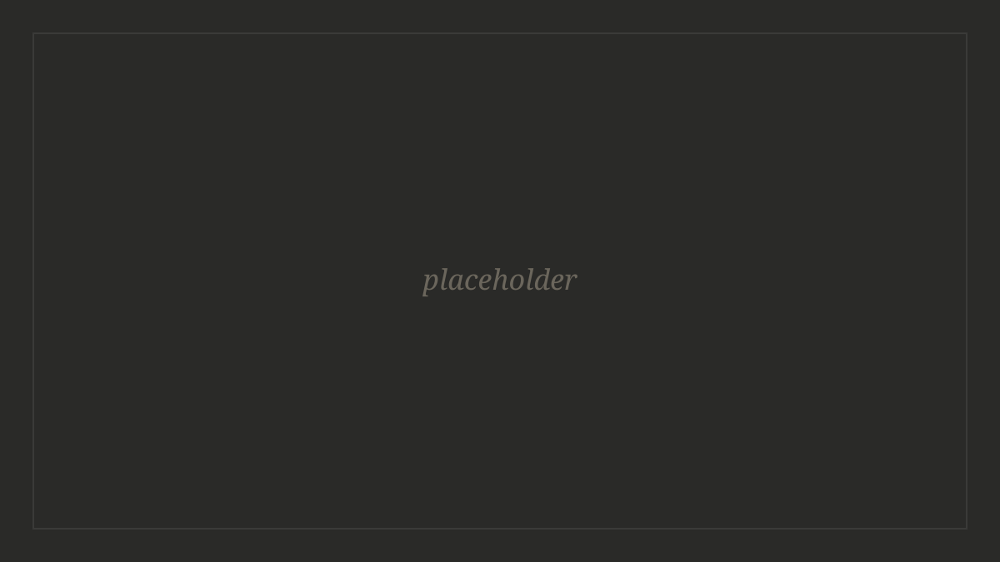
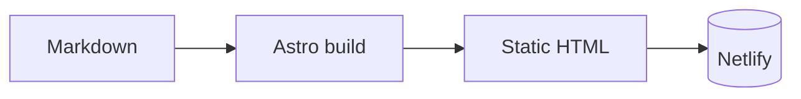

This is the opening paragraph, and it gets the treatment a magazine gives one: a
drop cap, small caps running through the first line, and no indent. Every
paragraph after it is set solid and marked by an indent instead of a gap, which
is how print has always done it and why a printed page reads calmer than a
typical web page.

Here is the second paragraph, so you can see the indent doing its work. The
measure is deliberately narrow — around sixty-eight characters — because a long
line makes the eye lose its place on the return sweep.[^measure]

## What this can render

Section headings are set in small caps rather than at some enormous size. They
mark a break without shouting.

Inline formatting works as expected: *italic*, **bold**, `inline code`, and
[links](https://astro.build) that underline on hover.

> Block quotes are set in italic against a hairline rule, indented from the
> measure. They are for quoting, not for emphasis.

---

### Images

Any image sitting alone in a paragraph becomes a figure, and its alt text
becomes the caption:



To skip the caption, leave the alt text empty.

### Diagrams

Fenced `mermaid` blocks render as diagrams. The library is only downloaded on
pages that contain one:



### Code

Highlighting happens at build time, so a code block costs nothing at runtime:

```ts
export function readingTime(body: string): string {
  const words = body.trim().split(/\s+/).length
  return `${Math.max(1, Math.round(words / 200))} min read`
}
```

### Footnotes

Drop a marker where the aside belongs, then define it anywhere in the file.[^aside]
The definitions get collected, numbered, and moved to the bottom no matter where
you write them, so they can sit right under the paragraph that needs them while
you are drafting.[^order] Each note gets a link back to where you left off.

### Tables

| Thing | Where it lives |
| --- | --- |
| Post body | `src/content/blog/<slug>/index.md` |
| Its images | the same folder |
| Prose styles | `src/styles/prose.scss` |

That is the whole toolkit. Writing a new post means making a folder, dropping in
an `index.md`, and putting its images beside it.

[^measure]: The usual advice is somewhere between forty-five and seventy-five
characters. Newspapers run much shorter, which is why a column reads so fast.

[^aside]: Like this one. A note can hold anything a paragraph can —
[links](https://astro.build), `code`, *emphasis*.

[^order]: This note was written second and defined second, but nothing forces
that. The numbering follows the order the markers appear in the text.
